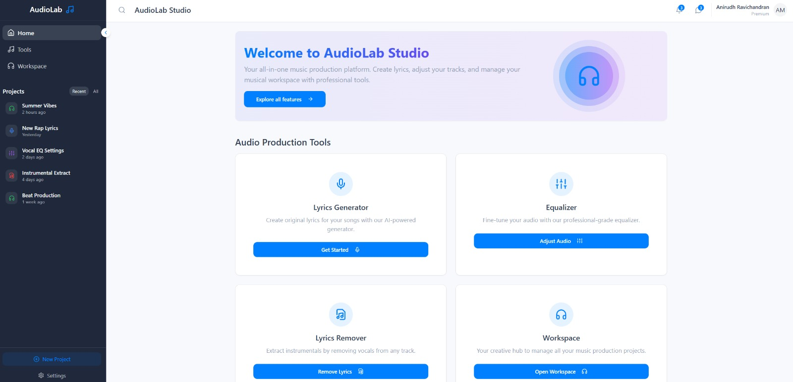
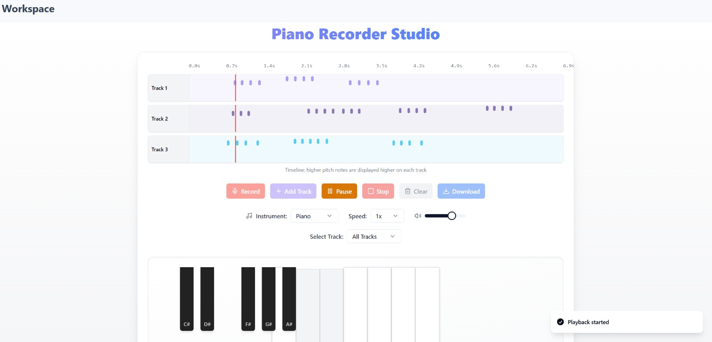
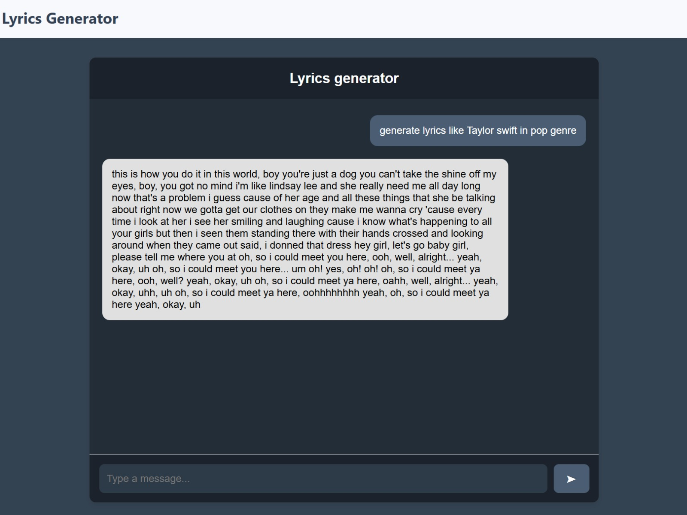
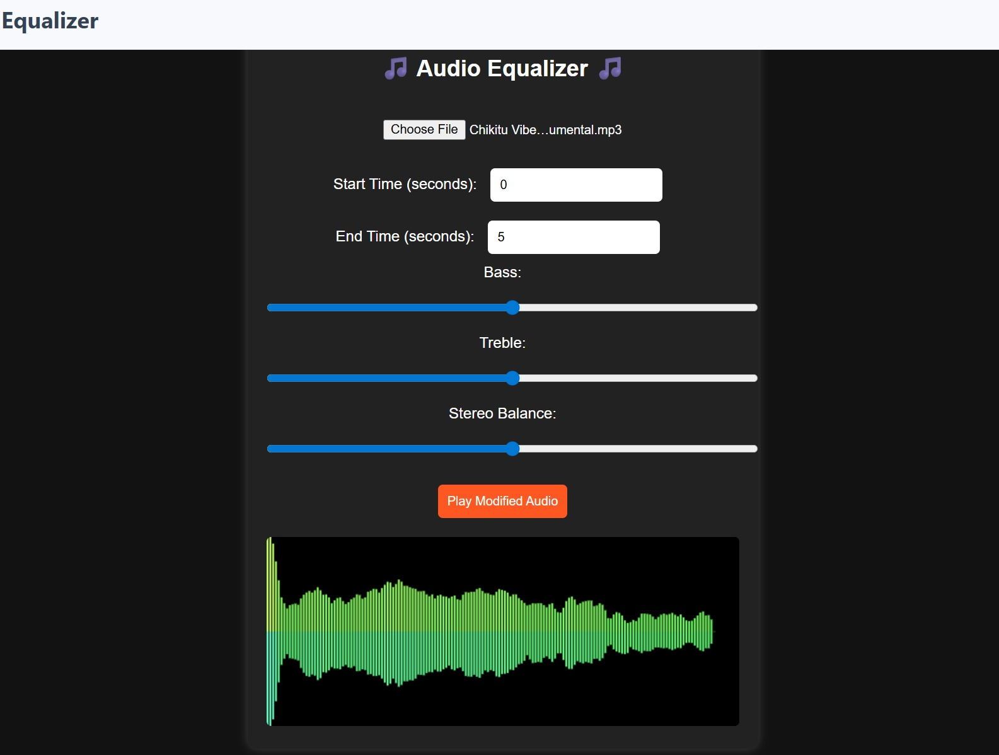

# AudioLab - Intelligent Audio Processing Suite

A comprehensive web application for audio processing, music analysis, and content generation. AudioLab combines cutting-edge machine learning models with an intuitive React-based interface to provide musicians, content creators, and audio engineers with powerful tools for audio manipulation and creative workflows.

## 📋 Table of Contents

- [Overview](#overview)
- [Features](#features)
- [Project Structure](#project-structure)
- [Tech Stack](#tech-stack)
- [Installation](#installation)
- [Usage](#usage)
- [API Endpoints](#api-endpoints)
- [Configuration](#configuration)
- [Contributing](#contributing)

## 🎯 Overview

AudioLab is a full-stack application designed to simplify complex audio processing tasks. It features a modern, responsive frontend built with React and TypeScript, paired with backend services powered by Express.js, Python, and FastAPI. The platform provides real-time audio processing, ML-based music analysis, and interactive tools for professional audio work.

### Home / Dashboard


### Workspace


### Lyrics Generator


### Audio Equalizer


## ✨ Features

### Core Audio Tools

1. **Lyrics Remover (Vocal Removal)**
   - Removes vocal tracks from audio files using advanced source separation techniques
   - Uses the Demucs model for high-quality stem separation
   - Preserves instrumental quality while removing vocals
   - Configurable vocal reduction and instrumental preservation levels
   - Real-time processing progress tracking

2. **Audio Equalizer**
   - 10-band professional equalizer interface
   - Frequency ranges from 32Hz to 16kHz
   - Real-time audio visualization
   - Play, pause, and seek controls
   - Save and load equalizer presets
   - Volume control

3. **Lyrics Generator**
   - AI-powered lyrics generation using GPT-2 and transformers
   - Genre-specific and mood-based generation
   - Customizable creativity levels
   - Support for structured prompt generation
   - Download and copy generated lyrics

### Advanced Features

- **User Authentication**
  - Sign up and login functionality
  - User profiles with customizable information
  - Profile pictures and genre preferences
  - Bio/description support

- **Genre Classification**
  - Automatic music genre classification using Google's VGGish model
  - TensorFlow Hub integration for embeddings
  - Audio feature extraction and analysis

- **Lyrics Formatting**
  - AI-powered lyrics structure analysis
  - Automatic detection of verses, choruses, and bridges
  - Text cleaning and similarity-based grouping
  - Integration with Google's Generative AI API

- **Workspace**
  - Project management interface
  - File organization and handling
  - Multi-tool integration

## 📁 Project Structure

```
SEP_FINAL/
├── AudioLab/                          # Main application
│   ├── public/                        # Backend Python/JavaScript files
│   │   ├── main.py                   # FastAPI server for audio processing
│   │   ├── app.py                    # Flask server for lyrics generation
│   │   ├── GenreClassifier.py        # ML model for genre classification
│   │   ├── formater.py               # Lyrics formatting using Gemini AI
│   │   ├── check.py                  # Text analysis utilities
│   │   ├── script.js                 # Frontend JavaScript utilities
│   │   ├── lyrics_generator/         # Pre-trained lyrics generation model
│   │   ├── separated/                # Output directory for separated audio stems
│   │   └── uploads/                  # Temporary file uploads directory
│   ├── src/                          # React/TypeScript frontend
│   │   ├── App.tsx                   # Main application component
│   │   ├── main.tsx                  # Application entry point
│   │   ├── index.css                 # Global styles
│   │   ├── components/
│   │   │   ├── tools/               # Audio tool components
│   │   │   │   ├── Equalizer.tsx
│   │   │   │   ├── LyricsGenerator.tsx
│   │   │   │   ├── LyricsRemover.tsx
│   │   │   │   └── Workspace.tsx
│   │   │   ├── layout/              # Layout components
│   │   │   │   ├── Header.tsx
│   │   │   │   ├── Sidebar.tsx
│   │   │   │   └── Inbox.tsx
│   │   │   └── ui/                  # Shadcn UI components library
│   │   ├── pages/                   # Route pages
│   │   │   ├── Index.tsx            # Home page
│   │   │   ├── Equalizer.tsx
│   │   │   ├── LyricsGenerator.tsx
│   │   │   ├── LyricsRemover.tsx
│   │   │   ├── Workspace.tsx
│   │   │   └── NotFound.tsx
│   │   ├── hooks/                   # Custom React hooks
│   │   └── lib/                     # Utility libraries
│   ├── server.js                    # Express.js backend server
│   ├── package.json                 # Node dependencies
│   ├── vite.config.ts               # Vite build configuration
│   ├── tailwind.config.ts           # Tailwind CSS configuration
│   ├── tsconfig.json                # TypeScript configuration
│   └── index.html                   # HTML entry point
│
└── Workspace/
    └── PianoInterface/              # Secondary project (Piano Interface)
        ├── src/                     # React/TypeScript source
        ├── package.json
        └── vite.config.ts
```

## 🛠 Tech Stack

### Frontend
- **React 18** - UI library
- **TypeScript** - Type safety
- **Vite** - Build tool and dev server
- **Tailwind CSS** - Utility-first CSS framework
- **Shadcn UI** - High-quality React components
- **TanStack React Query** - Server state management
- **React Router** - Client-side routing
- **Radix UI** - Accessible component primitives

### Backend
- **Express.js** - Node.js web framework
- **FastAPI** - Python web framework for audio processing
- **Flask** - Python web framework for lyrics generation
- **MongoDB** - NoSQL database for user data
- **Mongoose** - MongoDB ODM

### Audio Processing & ML
- **Demucs** - Source separation for vocal removal
- **TensorFlow Hub** - Pre-trained ML models
- **Librosa** - Audio analysis library
- **Transformers (Hugging Face)** - NLP models for lyrics generation
- **GPT-2** - Text generation model
- **pydub** - Audio format conversion
- **Google Generative AI** - Gemini API for content formatting

### Additional Libraries
- **bcryptjs** - Password hashing
- **CORS** - Cross-origin request handling
- **ESLint** - Code linting
- **Multer** - File upload handling

## 🚀 Installation

### Prerequisites
- Node.js (v18+) and npm/yarn
- Python 3.8+
- MongoDB (local or remote)
- Git

### Frontend Setup

1. **Navigate to the AudioLab directory:**
   ```bash
   cd AudioLab
   ```

2. **Install dependencies:**
   ```bash
   npm install
   # or
   yarn install
   # or
   bun install
   ```

3. **Start the development server:**
   ```bash
   npm run dev
   ```
   The application will be available at `http://localhost:5173`

### Backend Setup

#### Express.js Server (User Authentication)

1. **Start the MongoDB server:**
   ```bash
   mongod
   ```

2. **Run the Express server:**
   ```bash
   node server.js
   ```
   The server will run on `http://localhost:5000`

#### FastAPI Server (Audio Processing)

1. **Install Python dependencies:**
   ```bash
   pip install fastapi uvicorn python-multipart cors demucs librosa pydub
   ```

2. **Run the FastAPI server:**
   ```bash
   python -m uvicorn main:app --reload
   ```
   The API will be available at `http://localhost:8000`

#### Flask Server (Lyrics Generation)

1. **Install additional Python dependencies:**
   ```bash
   pip install flask flask-cors transformers better-profanity google-generativeai
   ```

2. **Run the Flask server:**
   ```bash
   python app.py
   ```
   The server will run on `http://localhost:5001` (configure as needed)

## 📖 Usage

### Lyrics Remover
1. Navigate to the Lyrics Remover page
2. Upload an audio file (MP3, WAV, etc.)
3. Adjust vocal reduction and instrumental preservation sliders
4. Click "Process Audio" to begin separation
5. Download the instrumental version when complete

### Audio Equalizer
1. Go to the Equalizer tool
2. Select or upload an audio track
3. Adjust the 10-band equalizer sliders to desired levels
4. Use play/pause controls to preview changes
5. Save your preset or export the processed audio

### Lyrics Generator
1. Access the Lyrics Generator tool
2. Enter a prompt (e.g., "lyrics like Taylor Swift in Pop genre")
3. Select genre and mood preferences
4. Adjust creativity slider (0-100)
5. Click "Generate Lyrics"
6. Copy or download the generated lyrics

### User Profile
1. Sign up with your information
2. Set your favorite music genre
3. Upload a profile picture
4. Add a bio/description
5. Access your personalized workspace

## 🔌 API Endpoints

### Express.js Server (Port 5000)

**Authentication & User Management**
- `POST /signup` - Create new user account
- `POST /login` - User login
- `GET /user/:id` - Get user profile
- `PUT /user/:id` - Update user profile

**File Uploads**
- `POST /upload` - Upload audio/profile files
- `GET /uploads/:filename` - Retrieve uploaded files

### FastAPI Server (Port 8000)

**Audio Processing**
- `POST /remove_vocals/` - Remove vocals from audio file
  - Input: Audio file (MP3, WAV)
  - Output: JSON with path to instrumental version
  
- `GET /download/{song_name}` - Download processed audio

### Flask Server (Port 5001)

**Lyrics Generation**
- `POST /api/chat` - Generate lyrics using AI
  - Input: User prompt, genre, mood
  - Output: Generated lyrics with formatting

**Analysis**
- `POST /analyze` - Analyze text structure and formatting

## ⚙️ Configuration

### Environment Variables

Create a `.env` file in the AudioLab root directory:

```
VITE_API_URL=http://localhost:5000
VITE_FASTAPI_URL=http://localhost:8000
VITE_FLASK_URL=http://localhost:5001
MONGODB_URI=mongodb://localhost:27017/audiolab
GOOGLE_API_KEY=your_google_generative_ai_key_here
```

### Database Configuration

Update the MongoDB connection string in `server.js`:
```javascript
mongoose.connect("mongodb://localhost:27017/audiolab", {
  useNewUrlParser: true,
  useUnifiedTopology: true,
});
```

### CORS Configuration

The servers are configured to accept requests from all origins. For production, update:

```javascript
// Express
app.use(cors({
  origin: process.env.FRONTEND_URL || "http://localhost:5173"
}));

// FastAPI
app.add_middleware(
    CORSMiddleware,
    allow_origins=["http://localhost:5173"],
    allow_credentials=True,
    allow_methods=["*"],
    allow_headers=["*"],
)
```

## 🏗️ Build

### Production Build

1. **Build the frontend:**
   ```bash
   npm run build
   ```

2. **Preview the build:**
   ```bash
   npm run preview
   ```

### Docker Support

Create a `Dockerfile` in the root directory for containerized deployment (optional).

## 📝 Scripts

### Available npm Scripts

```bash
npm run dev        # Start development server
npm run build      # Build for production
npm run build:dev  # Build in development mode
npm run lint       # Run ESLint
npm run preview    # Preview production build
```

## 🔒 Security Considerations

- Passwords are hashed using bcryptjs before storage
- CORS is enabled for cross-origin requests
- File uploads are stored in designated directories
- API requests should be authenticated in production
- Google API keys should be stored securely and not exposed in client code

## 🤝 Contributing

1. Create a feature branch: `git checkout -b feature/your-feature`
2. Commit changes: `git commit -m 'Add your feature'`
3. Push to branch: `git push origin feature/your-feature`
4. Submit a pull request

## 📄 License

This project is provided as-is for educational and commercial use.

## 🆘 Troubleshooting

### Common Issues

**Audio files not processing:**
- Ensure FastAPI server is running
- Check that Demucs is properly installed: `pip install demucs`
- Verify file permissions in upload/separated directories

**Lyrics not generating:**
- Confirm Flask server is running
- Check Google Generative AI API key is valid
- Verify transformers models are downloaded

**Database connection errors:**
- Ensure MongoDB is running: `mongod`
- Check connection string in server.js
- Verify MongoDB credentials

**Port conflicts:**
- Change port in respective server files if ports are in use
- Update environment variables accordingly

## 📞 Support

For issues, feature requests, or contributions, please reach out or submit an issue through the project repository.

---

**AudioLab** - Making audio processing accessible to everyone. 🎵
